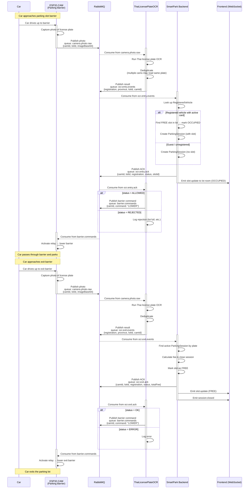

# SmartPark Parking Flow — Sequence Diagram

```mermaid
sequenceDiagram
    participant Car
    participant Barrier as ESP32-CAM<br/>(Parking Barrier)
    participant RMQ as RabbitMQ
    participant OCR as ThaiLicensePlateOCR
    participant Backend as SmartPark Backend
    participant WS as Frontend (WebSocket)

    %% ── ENTRY FLOW ──────────────────────────────────────────

    Note over Car, Barrier: Car approaches parking slot barrier

    Car->>Barrier: Car drives up to barrier
    activate Barrier
    Barrier->>Barrier: Capture photo of license plate
    Barrier->>RMQ: Publish photo<br/>queue: camera.photo.raw<br/>{camId, lotId, imageBase64}
    deactivate Barrier

    activate OCR
    RMQ-->>OCR: Consume from camera.photo.raw
    OCR->>OCR: Run Thai license plate OCR
    OCR->>OCR: Deduplicate<br/>(multiple cams may read same plate)
    OCR->>RMQ: Publish result<br/>queue: ocr.entry.events<br/>{registration, province, lotId, camId}
    deactivate OCR

    activate Backend
    RMQ-->>Backend: Consume from ocr.entry.events
    Backend->>Backend: Look up RegisteredVehicle
    alt Registered vehicle with active card
        Backend->>Backend: Find FREE slot in lot → mark OCCUPIED
        Backend->>Backend: Create ParkingSession (with slot)
    else Guest / unregistered
        Backend->>Backend: Create ParkingSession (no slot)
    end
    Backend->>RMQ: Publish ACK<br/>queue: ocr.entry.ack<br/>{camId, lotId, registration, status, slotId}
    Backend->>WS: Emit slot:update to lot room (OCCUPIED)
    deactivate Backend

    activate OCR
    RMQ-->>OCR: Consume from ocr.entry.ack
    alt status = ALLOWED
        OCR->>RMQ: Publish barrier command<br/>queue: barrier.commands<br/>{camId, command: "LOWER"}
    else status = REJECTED
        OCR->>OCR: Log rejection (lot full, etc.)
    end
    deactivate OCR

    activate Barrier
    RMQ-->>Barrier: Consume from barrier.commands
    Barrier->>Barrier: Activate relay → lower barrier
    deactivate Barrier
    Note over Car, Barrier: Car passes through barrier and parks

    %% ── EXIT FLOW ───────────────────────────────────────────

    Note over Car, Barrier: Car approaches exit barrier

    Car->>Barrier: Car drives up to exit barrier
    activate Barrier
    Barrier->>Barrier: Capture photo of license plate
    Barrier->>RMQ: Publish photo<br/>queue: camera.photo.raw<br/>{camId, lotId, imageBase64}
    deactivate Barrier

    activate OCR
    RMQ-->>OCR: Consume from camera.photo.raw
    OCR->>OCR: Run Thai license plate OCR
    OCR->>OCR: Deduplicate
    OCR->>RMQ: Publish result<br/>queue: ocr.exit.events<br/>{registration, province, lotId, camId}
    deactivate OCR

    activate Backend
    RMQ-->>Backend: Consume from ocr.exit.events
    Backend->>Backend: Find active ParkingSession by plate
    Backend->>Backend: Calculate fee & close session
    Backend->>Backend: Mark slot as FREE
    Backend->>RMQ: Publish ACK<br/>queue: ocr.exit.ack<br/>{camId, lotId, registration, status, totalFee}
    Backend->>WS: Emit slot:update (FREE)
    Backend->>WS: Emit session:closed
    deactivate Backend

    activate OCR
    RMQ-->>OCR: Consume from ocr.exit.ack
    alt status = OK
        OCR->>RMQ: Publish barrier command<br/>queue: barrier.commands<br/>{camId, command: "LOWER"}
    else status = ERROR
        OCR->>OCR: Log error
    end
    deactivate OCR

    activate Barrier
    RMQ-->>Barrier: Consume from barrier.commands
    Barrier->>Barrier: Activate relay → lower exit barrier
    deactivate Barrier
    Note over Car, Barrier: Car exits the parking lot
```
