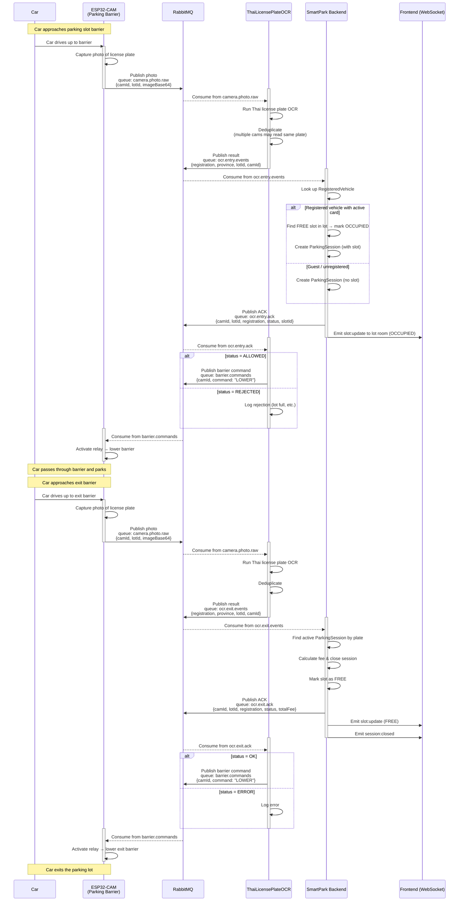

# SmartPark Parking Flow — Sequence Diagram

```mermaid
sequenceDiagram
    participant Car
    participant Barrier as ESP32-CAM<br/>(Parking Barrier)
    participant RMQ as RabbitMQ
    participant OCR as ThaiLicensePlateOCR
    participant Backend as SmartPark Backend
    participant WS as Frontend (WebSocket)

    %% ── ENTRY FLOW ──────────────────────────────────────────

    Note over Car, Barrier: Car approaches parking slot barrier

    Car->>Barrier: Car drives up to barrier
    activate Barrier
    Barrier->>Barrier: Capture photo of license plate
    Barrier->>RMQ: Publish photo<br/>queue: camera.photo.raw<br/>{camId, lotId, imageBase64}
    deactivate Barrier

    activate OCR
    RMQ-->>OCR: Consume from camera.photo.raw
    OCR->>OCR: Run Thai license plate OCR
    OCR->>OCR: Deduplicate<br/>(multiple cams may read same plate)
    OCR->>RMQ: Publish result<br/>queue: ocr.entry.events<br/>{registration, province, lotId, camId}
    deactivate OCR

    activate Backend
    RMQ-->>Backend: Consume from ocr.entry.events
    Backend->>Backend: Look up RegisteredVehicle
    alt Registered vehicle with active card
        Backend->>Backend: Find FREE slot in lot → mark OCCUPIED
        Backend->>Backend: Create ParkingSession (with slot)
    else Guest / unregistered
        Backend->>Backend: Create ParkingSession (no slot)
    end
    Backend->>RMQ: Publish ACK<br/>queue: ocr.entry.ack<br/>{camId, lotId, registration, status, slotId}
    Backend->>WS: Emit slot:update to lot room (OCCUPIED)
    deactivate Backend

    activate OCR
    RMQ-->>OCR: Consume from ocr.entry.ack
    alt status = ALLOWED
        OCR->>RMQ: Publish barrier command<br/>queue: barrier.commands<br/>{camId, command: "LOWER"}
    else status = REJECTED
        OCR->>OCR: Log rejection (lot full, etc.)
    end
    deactivate OCR

    activate Barrier
    RMQ-->>Barrier: Consume from barrier.commands
    Barrier->>Barrier: Activate relay → lower barrier
    deactivate Barrier
    Note over Car, Barrier: Car passes through barrier and parks

    %% ── EXIT FLOW ───────────────────────────────────────────

    Note over Car, Barrier: Car approaches exit barrier

    Car->>Barrier: Car drives up to exit barrier
    activate Barrier
    Barrier->>Barrier: Capture photo of license plate
    Barrier->>RMQ: Publish photo<br/>queue: camera.photo.raw<br/>{camId, lotId, imageBase64}
    deactivate Barrier

    activate OCR
    RMQ-->>OCR: Consume from camera.photo.raw
    OCR->>OCR: Run Thai license plate OCR
    OCR->>OCR: Deduplicate
    OCR->>RMQ: Publish result<br/>queue: ocr.exit.events<br/>{registration, province, lotId, camId}
    deactivate OCR  

    activate Backend
    RMQ-->>Backend: Consume from ocr.exit.events
    Backend->>Backend: Find active ParkingSession by plate
    Backend->>Backend: Calculate fee & close session
    Backend->>Backend: Mark slot as FREE
    Backend->>RMQ: Publish ACK<br/>queue: ocr.exit.ack<br/>{camId, lotId, registration, status, totalFee}
    Backend->>WS: Emit slot:update (FREE)
    Backend->>WS: Emit session:closed
    deactivate Backend

    activate OCR
    RMQ-->>OCR: Consume from ocr.exit.ack
    alt status = OK
        OCR->>RMQ: Publish barrier command<br/>queue: barrier.commands<br/>{camId, command: "LOWER"}
    else status = ERROR
        OCR->>OCR: Log error
    end
    deactivate OCR

    activate Barrier
    RMQ-->>Barrier: Consume from barrier.commands
    Barrier->>Barrier: Activate relay → lower exit barrier
    deactivate Barrier
    Note over Car, Barrier: Car exits the parking lot
```

---

# Card Registration Flow — Sequence Diagram

> 3-step wizard at `/edit/add-card`

```mermaid
sequenceDiagram
    participant User as User (Browser)
    participant FE as React Frontend
    participant BE as SmartPark Backend
    participant DB as PostgreSQL (Prisma)

    %% ── STEP 1 — Card Details ─────────────────────────────

    Note over User, FE: Step 1 — Enter Card Details

    User->>FE: Navigate to /edit/add-card
    FE->>FE: Render card form<br/>(card number, cardholder name,<br/>expiry month/year, label)
    User->>FE: Fill in 16-digit card number,<br/>cardholder name, expiry, label
    User->>FE: Click "Next"

    FE->>FE: detectIssuer(cardNumber)<br/>→ Identifies network (VISA, MASTERCARD, etc.)

    FE->>BE: GET /api/parking/lots
    activate BE
    BE->>DB: Query ParkingLot + PrivilegeProgram<br/>(with eligible_bins)
    DB-->>BE: Parking lots with program details
    BE-->>FE: 200 OK — List of parking lots
    deactivate BE

    FE->>FE: Filter lots whose program<br/>eligible_bins match card BIN

    %% ── STEP 2 — Privileges Preview ──────────────────────

    Note over User, FE: Step 2 — Privileges Preview

    FE->>User: Display detected issuer (e.g., VISA)<br/>and qualifying parking lots
    Note right of FE: Informational only —<br/>no API calls

    User->>FE: Click "Next"

    %% ── STEP 3 — Vehicle Registration ────────────────────

    Note over User, FE: Step 3 — Register Vehicle

    FE->>FE: Render vehicle form<br/>(license plate, province,<br/>brand, model, color)
    User->>FE: Fill in vehicle details
    User->>FE: Click "Save Card"

    %% ── API Call 1: Create Card ──────────────────────────

    FE->>BE: POST /api/users/cards<br/>Authorization: Bearer <token><br/>{ card_number, expiry_month, expiry_year,<br/>  cardholder_name, label }
    activate BE
    BE->>BE: Validate card_number,<br/>expiry_month, expiry_year required
    BE->>BE: Extract BIN (first 6 digits),<br/>last four, detect network
    BE->>DB: Query PrivilegeProgram<br/>where eligible_bins contains BIN
    DB-->>BE: Matching program (or none)

    alt No matching program
        BE-->>FE: 400 — "No privilege program found for this card."
        FE->>User: Show error message
    else Program found
        BE->>DB: INSERT UserCard<br/>(user_id, program_id, network,<br/>bin, last_four, expiry_month,<br/>expiry_year, cardholder_name, label)
        DB-->>BE: Created card record
        BE-->>FE: 201 Created — { card_id, program, ... }
    end
    deactivate BE

    %% ── API Call 2: Register Vehicle ─────────────────────

    FE->>BE: POST /api/users/vehicles<br/>Authorization: Bearer <token><br/>{ registration, province, brand,<br/>  model, color, card_id }
    activate BE
    BE->>BE: Validate registration,<br/>province, card_id required
    BE->>DB: Query UserCard by card_id
    DB-->>BE: Card record

    alt Card not found
        BE-->>FE: 404 — "Card not found."
        FE->>User: Show error message
    else Card not owned by user
        BE-->>FE: 403 — "You do not own this card."
        FE->>User: Show error message
    else Valid card
        BE->>DB: UPSERT RegisteredVehicle<br/>(registration, province, brand,<br/>model, color) + link to card_id
        DB-->>BE: Created vehicle record
        BE-->>FE: 201 Created — { vehicle_id, registration, ... }
    end
    deactivate BE

    %% ── Post-Save ────────────────────────────────────────

    Note over User, FE: Post-Save — Refresh & Navigate

    FE->>BE: GET /api/users/cards<br/>Authorization: Bearer <token>
    activate BE
    BE->>DB: Query cards for user
    DB-->>BE: Updated card list
    BE-->>FE: 200 OK — Cards[]
    deactivate BE

    FE->>BE: GET /api/users/vehicles<br/>Authorization: Bearer <token>
    activate BE
    BE->>DB: Query vehicles for user
    DB-->>BE: Updated vehicle list
    BE-->>FE: 200 OK — Vehicles[]
    deactivate BE

    FE->>FE: Update AuthContext<br/>with refreshed cards & vehicles
    FE->>User: Navigate to /edit<br/>(card list page)
```
